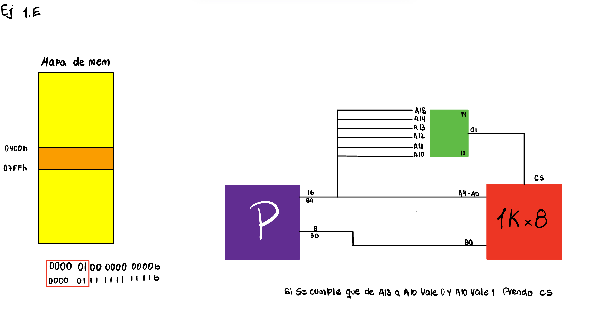

# Ej1

## A 
```
Puede acceder a $2^{16} = 2^6 \cdot2^{10} = 64K$ direcciones de memoria, cada una de 1 byte
El ancho de la palabra es 1 byte 
Tiene un espacio de memoria de 64KB
```
## B 
```
Puede acceder a $2^{16} = 2^6 \cdot2^{10} = 64K$ direcciones de memoria, cada una de 2 bytes.
El ancho de la palabra es de 2 bytes
Tiene un espacio de 128KB
```
## C
```
Puede acceder a $2^{10} = 1K$  direcciones de memoria, cada una de 1 byte.
El ancho de la palabra es de 1 byte.
Tiene un espacio de 1KB.
```
## D
```
Puede acceder a $2^{10} = 1K$  direcciones de memoria, cada una de 2 bytes.
El ancho de la palabra es de 2 bytes.
Tiene un espacio de 2KB.
```
## E


